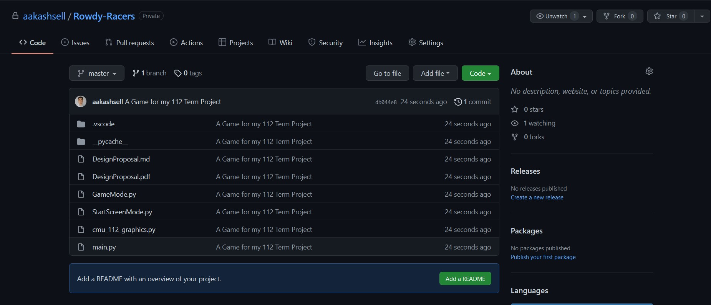

# Term Project Poject Proposal

By Aakash Sell

## Project Description

My project is going to be called Rowdy Racers. In this game players are going to race against ai racers on a series of pre-made and player made tracks. The default mode will be a single player game in which the player will race against ai. The other two modes will consist of arcade mode in which the player will drive forever until they crash or sustain too much damage. The third gamemode will be a 1v1 mode in which two player will race solely against one another. All of the previous modes will also be available with a 2 player mode.

The track generator will be a screen in which the user will be able to draw a line on their screen with a mouse and that will be turned into a playable track by the game.

## Competitive Analysis

My game is a top down 2d car racing game which was very popular during the early era of arcade games. 

One project I saw online was Top Down Racer for Nintendo Switch. This game is very similar to the game I am creating with a few changes. This game is a top down game and involves the player racing against other cars. This game is only on pre-made tracks while my game will also implement player made and randomly generated tracks. This game also implements car damage and boosts into the gameplay. My game may implement these things but they are dependant on time constraints. This game also uses pixel art which my game will not utilize. At its core, my game is a simpler and less robust version of Top Down Racer with a few changes. 

## Structural Plan

This project will use modes in that whenever a different aspect of the game is shown, a separate mode will be used. Each screen has its own set of functions and are separate from each other other than the fact that they all have access to a set of shared app wide variables. I am going to try to separate each mode into a separate file in order to help make the project cleaner but that is not the top priority right now.

## Algorithmic Plan

The most algorithmically complex parts of my project consist of the ai path finding and track generation.

The ai needs to be able to traverse the track while also making mistakes so its possible to win. The ai needs to be able to stay on the track as well as being able to avoid the player in order to win. This will just follow the track and have a randomly generated amount of mistakes that will allow the player to win against the car.

The track generation needs to be able to generate track on the fly as 112 graphics lags when a large track is pre-loaded. This will be done by adding points to the line as the track moving behind is disappearing under the canvas. This will be random and allow the player to drive on a track that changes direction at a moments notice. 

## Timeline Plan

I plan on finishing basic track generation. After this I will work on the ai and make it able to drive on the track in a manner that looks smooth and natural. After this I will implement the game mechanics such as the ai racing the player as well as the race finishing. After this I will complete the track creator and have it be fully implemented. Once this is done and if I still have time I will add more game machanics such as power up and crashing as well as implementing a player two feature. 

## Version Control Plan

I plan on using GitHub to backup and store my code. This will be stored on the GitHub servers and will not be stored on my local device.

## Module LIst

No external modules are going to be used in this project.
